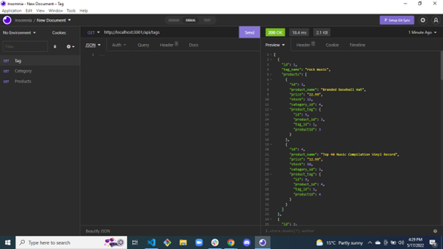
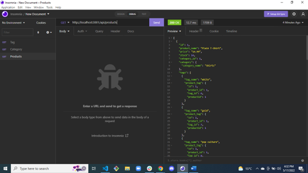

# E-commerce-website-by-Reem

## Description 

This app is the backend portion of an E-Commerce website. Express.js was used for the server and MySQL for the database along with Sequelize as the ORM to run SQL models and queries. The SQL database includes tables for products, categories, tags, and product tags. RESTful API routes are used to make requests and updates from the database which are joined through Sequelize queries.

## Technologies Used

- Javascript
- Node.js
- Sequelize
- MySQL2
- Express
- Dotenv

## ScreenShots

## Walkthrough video

https://drive.google.com/file/d/1mFwwn-4wnzsHkmLPtapJyUoor-a9iEVU/view?usp=sharing

## Installation 

-git clone the repo https://github.com/ReemMDA99/ecommerce-website-by-reem

- Install Node.js and mySQL2

- Install dependencies 
    - npm init --y
    - npm install express sequelize mysql

- Initiate mySQL shell using the command 'mysql -u root -p'.

- Create the schema from the MySQL shell using 'source db/schema.sql' and then 'USE ecommerce_db' and then quit

- After creating the models and routes, run 'npm run seed' to seed data to your database so that you can test your routes.

- To start running application simply input 'npm start' or 'node server.js'

## Usage 

You’ll need to use the MySQL2 (Links to an external site.) and Sequelize (Links to an external site.) packages to connect your Express.js API to a MySQL database and the dotenv package (Links to an external site.) to use environment variables to store sensitive data, like your MySQL username, password, and database name.

Use the schema.sql file in the db folder to create your database using MySQL shell commands. Use environment variables to store sensitive data, like your MySQL username, password, and database name.

## Test 

This application is test on Insomnia.

## User Story

AS A manager at an internet retail company
I WANT a back end for my e-commerce website that uses the latest technologies
SO THAT my company can compete with other e-commerce companies

## Acceptance Criteria

GIVEN a functional Express.js API
WHEN I add my database name, MySQL username, and MySQL password to an environment variable file
THEN I am able to connect to a database using Sequelize
WHEN I enter schema and seed commands
THEN a development database is created and is seeded with test data
WHEN I enter the command to invoke the application
THEN my server is started and the Sequelize models are synced to the MySQL database
WHEN I open API GET routes in Insomnia for categories, products, or tags
THEN the data for each of these routes is displayed in a formatted JSON
WHEN I test API POST, PUT, and DELETE routes in Insomnia
THEN I am able to successfully create, update, and delete data in my database

## Submissions

- GitHub Repo URL: 
    https://github.com/ReemMDA99/ecommerce-website-by-reem

- A walkthrough video demonstrating the application:

https://drive.google.com/file/d/1mFwwn-4wnzsHkmLPtapJyUoor-a9iEVU/view?usp=sharing